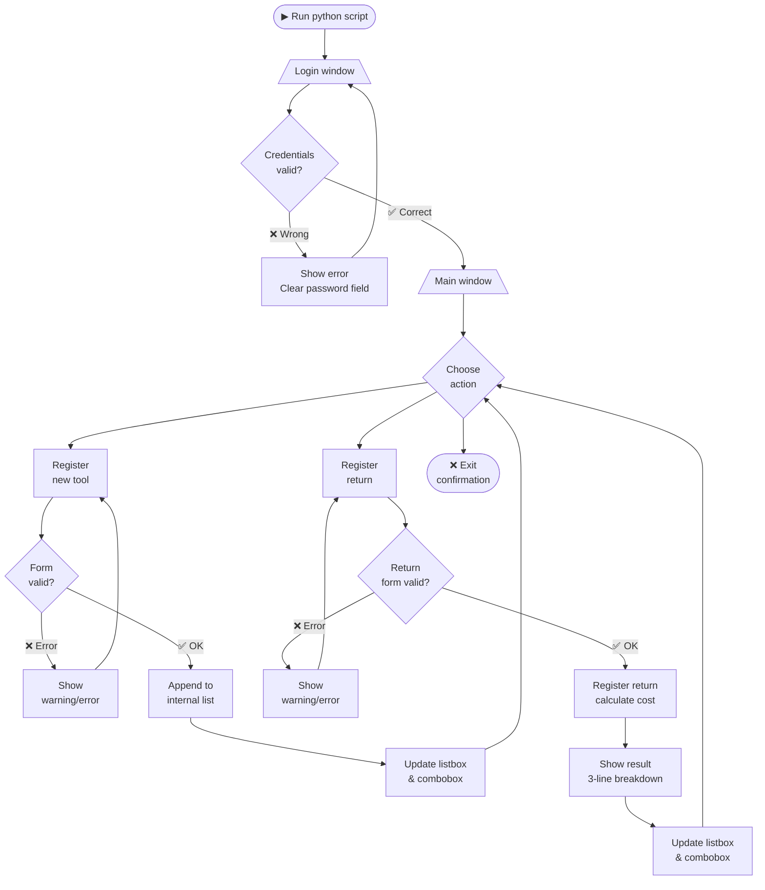
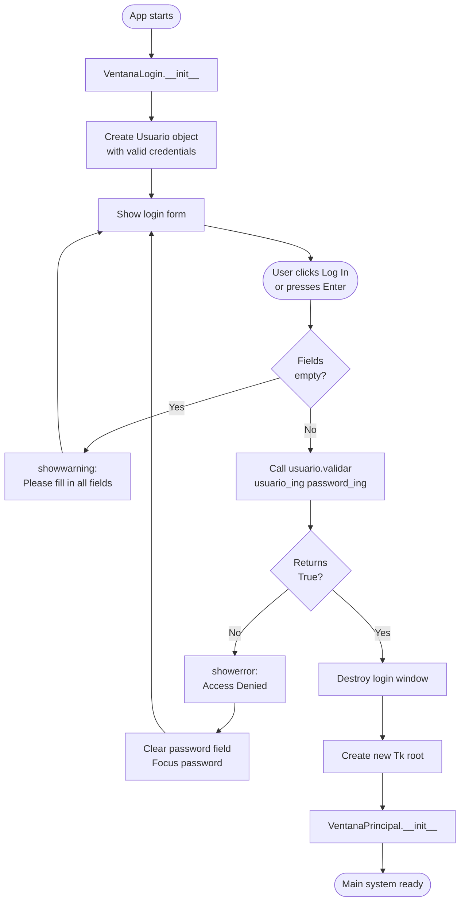
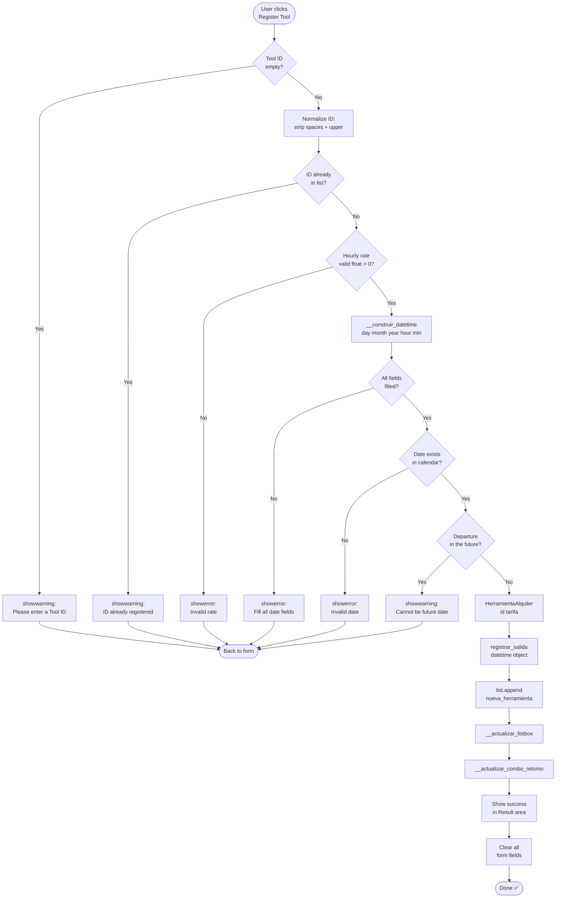
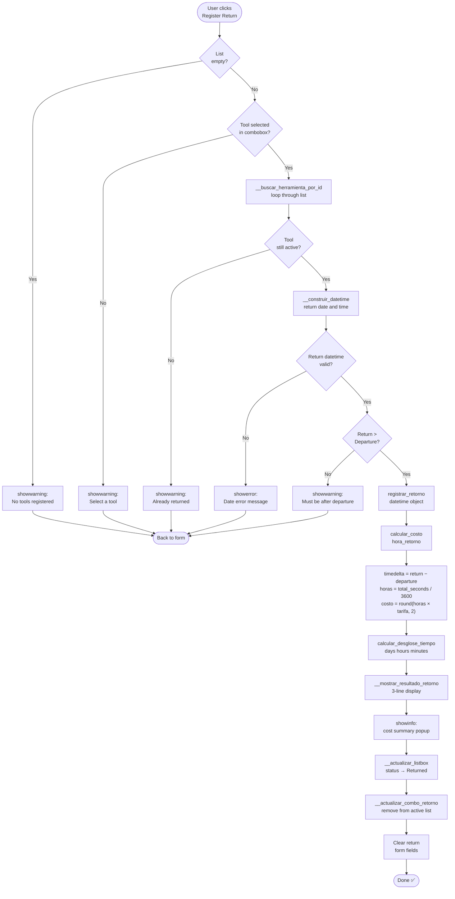
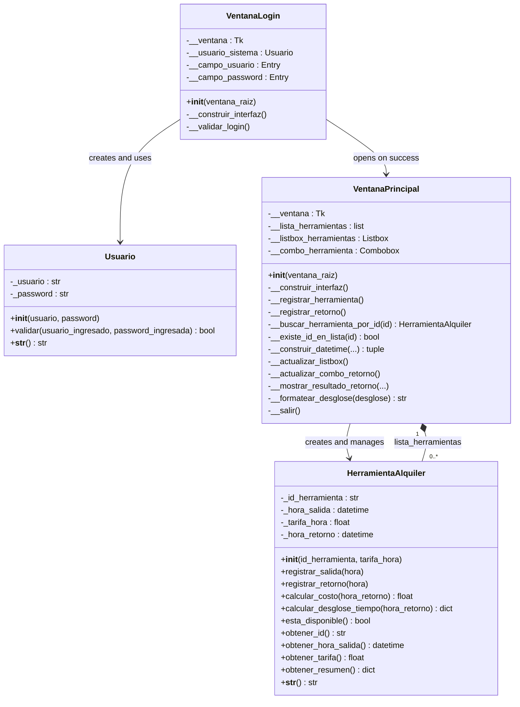

# ⚙ Tool Rental System

**Universidad Nacional Abierta y a Distancia — UNAD**  
Curso: Programación - 213023_344 |
Fase 2: Diseño y Programación Orientada a Objetos — Ejercicio 5  
Python 3 + Tkinter | Marzo 2026

---

## Tabla de Contenidos

1. [Descripción General](#1-descripción-general)
2. [Flujo de la Aplicación](#2-flujo-de-la-aplicación)
3. [Estructura del Proyecto](#3-estructura-del-proyecto)
4. [Requisitos y Ejecución](#4-requisitos-y-ejecución)
5. [Flujo de Uso Detallado](#5-flujo-de-uso-detallado)
6. [Clases y Programación Orientada a Objetos](#6-clases-y-programación-orientada-a-objetos)
7. [Validaciones del Sistema](#7-validaciones-del-sistema)
8. [Constantes del Sistema](#8-constantes-del-sistema)
9. [Lista Interna de Herramientas](#9-lista-interna-de-herramientas)
10. [Interfaz Gráfica Tkinter](#10-interfaz-gráfica-tkinter)
11. [Preguntas Frecuentes](#11-preguntas-frecuentes)
12. [Relación con la Rúbrica de Evaluación](#12-relación-con-la-rúbrica-de-evaluación)

---

## 1. Descripción General

**Tool Rental System** es una aplicación de escritorio desarrollada en **Python 3** con interfaz gráfica **Tkinter** para el curso de Programación (código 213023) de la UNAD, Fase 2. El sistema permite a un taller de alquiler de herramientas registrar la salida y retorno de herramientas, calcular automáticamente el costo según las horas de uso y validar todas las entradas del usuario.

### Características principales

- Módulo de inicio de sesión (login) con validación de credenciales antes de acceder al sistema.
- Registro de herramientas con fecha, hora y tarifa por hora.
- Lista interna de herramientas implementada como lista de Python (`list`).
- Registro de retorno con cálculo automático del costo total.
- Desglose del tiempo de uso en días, horas y minutos.
- Validaciones completas: IDs duplicados, fechas inválidas, tarifas, rangos de hora y minuto.
- Normalización de IDs a MAYÚSCULAS (`hd420` == `HD420` == `h d 420`).
- Interfaz gráfica completamente en inglés con paleta de colores **Iron Man**.

---

## 2. Flujo de la Aplicación

### 2.1 Flujo general — de inicio a cierre



---

### 2.2 Flujo detallado — login



---

### 2.3 Flujo detallado — registrar herramienta



---

### 2.4 Flujo detallado — registrar retorno y calcular costo



---

### 2.5 Diagrama de clases



---

## 3. Estructura del Proyecto

El proyecto consta de un único archivo fuente `.py` tal como lo requiere la guía del curso:

```
ejercicio5_alquiler_herramientas.py
│
├── Constantes del sistema (credenciales, rangos, colores)
│
├── class Usuario
│     ├── _usuario                        (atributo privado)
│     ├── _password                       (atributo privado)
│     └── validar()                       (método público)
│
├── class HerramientaAlquiler
│     ├── _id_herramienta                 (atributo privado)
│     ├── _hora_salida                    (atributo privado)
│     ├── _tarifa_hora                    (atributo privado)
│     ├── _hora_retorno                   (atributo privado - interno)
│     ├── registrar_salida(hora)
│     ├── registrar_retorno(hora)
│     ├── calcular_costo(hora_retorno)
│     ├── calcular_desglose_tiempo(hora_retorno)
│     ├── obtener_id()
│     └── ... (getters y helpers)
│
├── class VentanaLogin
│     └── Pantalla de inicio de sesión (Tkinter)
│
├── class VentanaPrincipal
│     ├── __lista_herramientas            (list interna)
│     └── Sistema principal de alquiler (Tkinter)
│
└── Punto de entrada:  if __name__ == '__main__'
```

---

## 3. Requisitos y Ejecución

### 3.1 Requisitos

| Componente | Detalle |
|---|---|
| Lenguaje | Python 3.8 o superior |
| Biblioteca GUI | Tkinter (incluida por defecto en Python) |
| Módulos usados | `tkinter`, `tkinter.ttk`, `tkinter.messagebox`, `datetime` |
| Instalación extra | Ninguna — solo Python estándar |
| IDE recomendado | Visual Studio Code con extensión Python |
| Sistema operativo | Windows, macOS o Linux |

### 3.2 Pasos para ejecutar

1. Abrir **Visual Studio Code**.
2. Abrir la carpeta que contiene el archivo `ejercicio5_alquiler_herramientas.py`.
3. Abrir una terminal integrada (`Ctrl + `` ` `` ` en Windows/Linux, `Cmd + `` ` `` ` en macOS).
4. Ejecutar el siguiente comando:

```bash
python ejercicio5_alquiler_herramientas.py
```

5. La ventana de login aparecerá automáticamente.

### 3.3 Credenciales de acceso

> 🔑 **Usuario:** `programacion`  &nbsp;&nbsp; **Contraseña:** `programacion`

---

## 4. Flujo de Uso

### 4.1 Pantalla de Login

Al iniciar la aplicación se muestra la ventana de inicio de sesión. El usuario debe ingresar las credenciales correctas para acceder al sistema principal. Si las credenciales son incorrectas, se bloquea el acceso y se muestra un mensaje de error. El campo de contraseña limpia su contenido automáticamente para permitir un nuevo intento.

> ⚠️ Si se deja cualquier campo vacío, el sistema muestra una advertencia y no permite continuar.

### 4.2 Registrar una herramienta nueva

En la sección **Register New Tool**, completar los siguientes campos:

- **Tool ID:** identificador único de la herramienta. Se convierte automáticamente a MAYÚSCULAS.
- **Hourly Rate ($):** tarifa cobrada por hora de alquiler. Debe ser un número mayor a cero.
- **Departure Date:** día, mes y año de salida en campos separados.
- **Departure Time:** hora (0–23) y minutos (0–59) de salida.

Hacer clic en **Register Tool**. La herramienta aparece en la lista con estado `Active`.

### 4.3 Registrar el retorno de una herramienta

1. En la sección **Register Return**, seleccionar la herramienta del menú desplegable (solo muestra herramientas activas).
2. Ingresar la fecha y hora de retorno.
3. Hacer clic en **Register Return**.
4. El sistema calcula automáticamente el tiempo usado y el costo total.
5. Los resultados se muestran en la sección **Result** con el desglose completo.
6. El estado de la herramienta cambia a `Returned` en la lista.

### 4.4 Sección Result — detalle del cálculo

Tras registrar un retorno, la sección **Result** muestra tres líneas:

```
Línea 1:  Tool: HD420   |   Out: 15/03/2026 08:00   |   In: 16/03/2026 12:30
Línea 2:  Time used:  1 day, 4 hrs, 30 min
Línea 3:  Calculation:  28.5 hrs  x  $5000/hr  =  $142500.00
```

---

## 5. Clases y Programación Orientada a Objetos

El sistema implementa los pilares de la POO aplicables al nivel del curso: **encapsulamiento**, **abstracción**, y uso de clases con responsabilidades claras y bien delimitadas.

---

### 5.1 Clase `Usuario`

Gestiona las credenciales de acceso al sistema. Sigue exactamente la especificación de la guía del curso.

| Elemento | Descripción |
|---|---|
| `_usuario` | Atributo privado (`str`). Nombre de usuario del sistema. |
| `_password` | Atributo privado (`str`). Contraseña del sistema. |
| `__init__(usuario, password)` | Constructor. Recibe y almacena las credenciales. |
| `validar(usuario_ing, password_ing)` | Compara las credenciales ingresadas con las almacenadas. Retorna `True` si coinciden, `False` si no. |
| `__str__()` | Representación en texto. Nunca expone la contraseña. |

#### Encapsulamiento en `Usuario`

Los atributos `_usuario` y `_password` usan guion simple (`_`) como convención de privacidad, exactamente como lo especifica la guía. El único punto de acceso a las credenciales es el método público `validar()`.

```python
# El atributo _usuario solo es accesible dentro de la clase
usuario = Usuario('programacion', 'programacion')
resultado = usuario.validar('programacion', 'programacion')  # True
resultado = usuario.validar('admin', '1234')                 # False
```

---

### 5.2 Clase `HerramientaAlquiler`

Modela cada herramienta dentro del sistema. Registra los momentos de salida y retorno como objetos `datetime` completos (fecha + hora + minutos), lo que permite calcular con precisión alquileres que abarcan varios días.

| Elemento | Descripción |
|---|---|
| `_id_herramienta` | Atributo privado (`str`). ID normalizado a MAYÚSCULAS. Ejemplo: `'HD420'`. |
| `_hora_salida` | Atributo privado (`datetime`). Fecha y hora exacta de salida. |
| `_tarifa_hora` | Atributo privado (`float`). Valor cobrado por hora de alquiler. |
| `_hora_retorno` | Atributo privado (`datetime`). Fecha y hora exacta de retorno. `None` hasta que se devuelva. |
| `registrar_salida(hora)` | Almacena el `datetime` de salida. |
| `registrar_retorno(hora)` | Almacena el `datetime` de retorno. |
| `calcular_costo(hora_retorno)` | Calcula el costo total restando los dos `datetime`, convirtiendo a horas decimales y multiplicando por la tarifa. |
| `calcular_desglose_tiempo(hora_retorno)` | Retorna un `dict` con días, horas y minutos de uso. |
| `obtener_id()` | Getter del ID (siempre en MAYÚSCULAS). |
| `obtener_hora_salida()` | Getter del `datetime` de salida. |
| `obtener_tarifa()` | Getter de la tarifa por hora. |
| `esta_disponible()` | Retorna `True` si la herramienta no ha sido retornada. |
| `obtener_resumen()` | Retorna un `dict` con todos los datos formateados para la interfaz. |

#### Cálculo del costo — explicación detallada

Python permite restar dos objetos `datetime` directamente. El resultado es un objeto `timedelta` que representa la diferencia exacta entre los dos momentos:

```python
diferencia_tiempo     = hora_retorno - self._hora_salida
# diferencia_tiempo es un timedelta
# .total_seconds() convierte la diferencia a segundos totales
total_horas_decimales = diferencia_tiempo.total_seconds() / 3600
costo = round(total_horas_decimales * self._tarifa_hora, 2)
```

El desglose de tiempo usa las propiedades internas de `timedelta`:

```python
diferencia_tiempo = hora_retorno - self._hora_salida
dias_completos    = diferencia_tiempo.days          # días enteros
segundos_rest     = diferencia_tiempo.seconds       # segundos del día parcial
horas_del_dia     = segundos_rest // 3600           # horas del día parcial
minutos_del_dia   = (segundos_rest % 3600) // 60   # minutos restantes
```

#### Normalización del ID

Para evitar duplicados por diferencias de capitalización o espacios, el ID se normaliza en el constructor:

```python
# En el constructor __init__:
self._id_herramienta = id_herramienta.replace(' ', '').upper()

# Todos estos IDs son equivalentes y se almacenan como 'HD420':
# 'hd420'  'HD420'  'Hd420'  'hd 420'  'H D 4 2 0'
```

---

### 5.3 Clase `VentanaLogin`

Controla la pantalla de inicio de sesión. Crea una instancia de `Usuario` y usa su método `validar()` para verificar las credenciales. Si son correctas, destruye la ventana de login y abre la ventana principal.

| Elemento | Descripción |
|---|---|
| `__ventana` | Referencia a la ventana raíz de Tkinter. |
| `__usuario_sistema` | Instancia de la clase `Usuario` con las credenciales válidas. |
| `__campo_usuario` | Campo de texto para el nombre de usuario. |
| `__campo_password` | Campo de texto enmascarado para la contraseña. |
| `__construir_interfaz()` | Método privado. Crea y organiza todos los elementos visuales del login. |
| `__validar_login()` | Método privado. Lee los campos, llama a `validar()` y abre el sistema o muestra error. |

---

### 5.4 Clase `VentanaPrincipal`

Es el núcleo del sistema. Gestiona la lista interna de herramientas y contiene toda la lógica de registro, retorno y cálculo de costos.

| Elemento | Descripción |
|---|---|
| `__lista_herramientas` | Lista interna (`list`) de objetos `HerramientaAlquiler`. Requerida por la guía del curso. |
| `__construir_interfaz()` | Coordina la construcción de las 4 secciones visuales y el botón de salida. |
| `__construir_seccion_registro()` | Crea el formulario de registro de nuevas herramientas. |
| `__construir_seccion_lista()` | Crea el listbox que muestra las herramientas registradas. |
| `__construir_seccion_retorno()` | Crea el formulario de retorno con combobox y campos de fecha/hora. |
| `__construir_seccion_resultado()` | Crea el área de 3 líneas que muestra el resultado del último retorno. |
| `__crear_campo(padre, etiqueta, ancho)` | **Helper.** Crea un `Label` + `Entry` y retorna el `Entry`. Evita repetir el mismo bloque 8 veces en las secciones de fecha/hora. |
| `__insertar_encabezado_listbox()` | **Helper.** Inserta las 2 líneas fijas del encabezado del listbox. Usado por `__construir_seccion_lista()` y `__actualizar_listbox()`. |
| `__limpiar_campos(lista_campos)` | **Helper.** Recorre una lista de `Entry` y borra su contenido. Evita repetir `.delete(0, END)` individualmente en cada campo. |
| `__validar_entero_en_rango(valor, min, max)` | Valida que un texto sea un entero dentro de un rango. Reutilizable para hora, minuto, día, mes y año. |
| `__construir_datetime(dia, mes, anio, hora, min)` | Convierte los 5 campos separados en un objeto `datetime`. Detecta fechas imposibles (30/02, etc.). |
| `__buscar_herramienta_por_id(id)` | Recorre la lista con un bucle `for` para encontrar una herramienta por ID. |
| `__existe_id_en_lista(id)` | Verifica si ya existe un ID en la lista. Usa `__buscar_herramienta_por_id()`. |
| `__actualizar_listbox()` | Reconstruye el listbox completo desde la lista interna. |
| `__actualizar_combo_retorno()` | Actualiza el combobox con solo los IDs de herramientas activas. |
| `__formatear_desglose(desglose)` | Convierte el `dict` de desglose en texto legible (`'1 day, 3 hrs, 30 min'`). |
| `__mostrar_resultado_retorno(...)` | Actualiza las 3 líneas del área de resultados. |
| `__registrar_herramienta()` | Valida el formulario y agrega la nueva herramienta a la lista. |
| `__registrar_retorno()` | Valida el retorno, registra la devolución y muestra el costo calculado. |
| `__salir()` | Solicita confirmación antes de cerrar la aplicación. |

---

## 6. Validaciones del Sistema

El sistema valida cada campo de entrada antes de procesar cualquier operación. Las validaciones están centralizadas en métodos privados reutilizables.

### 6.1 Registro de herramienta

| Campo | Validación aplicada |
|---|---|
| Tool ID | No puede estar vacío. No puede repetirse (búsqueda en la lista). Se normaliza a MAYÚSCULAS. |
| Hourly Rate | Debe ser un número válido (`float`). Debe ser mayor a cero. |
| Departure Date | Día, mes y año deben ser enteros. El año debe estar entre 2000 y 2100. La fecha debe existir en el calendario (Python rechaza 30/02, 31/11, etc.). |
| Departure Time | La hora debe ser un entero entre 0 y 23. Los minutos deben ser un entero entre 0 y 59. |
| Fecha futura | La fecha/hora de salida no puede estar en el futuro. |

### 6.2 Registro de retorno

| Condición | Validación aplicada |
|---|---|
| Lista vacía | Si no hay herramientas registradas, se muestra advertencia. |
| Sin selección | El usuario debe elegir una herramienta del combobox. |
| Ya retornada | No se puede retornar una herramienta con estado `Returned`. |
| Return Date | Mismas validaciones que Departure Date. |
| Return Time | Mismas validaciones que Departure Time. |
| Orden cronológico | El retorno debe ser estrictamente posterior a la salida. |

### 6.3 Mensajes de error

| Tipo | Cuándo se usa |
|---|---|
| `messagebox.showwarning()` | Datos faltantes o inconsistentes (campos vacíos, ID duplicado, fecha futura, retorno antes de salida). |
| `messagebox.showerror()` | Errores de formato (tarifa no numérica, fecha inválida, hora fuera de rango). |
| `messagebox.showinfo()` | Confirmación exitosa del registro de retorno con el resumen de costo. |
| `messagebox.askyesno()` | Confirmación antes de cerrar la aplicación. |

---

## 7. Constantes del Sistema

Todos los valores fijos del sistema están declarados como constantes al inicio del archivo, lo que facilita su localización y modificación:

| Constante | Valor | Propósito |
|---|---|---|
| `USUARIO_VALIDO` | `'programacion'` | Credencial de usuario aceptada. |
| `CONTRASENA_VALIDA` | `'programacion'` | Credencial de contraseña aceptada. |
| `HORA_MINIMA` | `0` | Hora mínima en formato 24 horas. |
| `HORA_MAXIMA` | `23` | Hora máxima en formato 24 horas. |
| `MINUTO_MINIMO` | `0` | Minuto mínimo permitido. |
| `MINUTO_MAXIMO` | `59` | Minuto máximo permitido. |
| `TARIFA_MINIMA` | `0` | La tarifa debe ser mayor a este valor. |
| `ANIO_MINIMO` | `2000` | Año mínimo aceptado para fechas. |
| `ANIO_MAXIMO` | `2100` | Año máximo aceptado para fechas. |
| `COLOR_FONDO` | `#2C3E50` | Gris oscuro Iron Man — fondo de ventanas. |
| `COLOR_PANEL` | `#34495E` | Gris medio — fondo de secciones. |
| `COLOR_ACENTO` | `#F39C12` | Dorado Iron Man — títulos y bordes. |
| `COLOR_BOTON_ACCION` | `#C0392B` | Rojo Iron Man — botones principales. |
| `COLOR_BOTON_RETORNO` | `#E67E22` | Naranja dorado — botón de retorno. |
| `COLOR_TEXTO_CLARO` | `#ECF0F1` | Blanco roto — texto sobre fondo oscuro. |

---

## 8. Lista Interna de Herramientas

La guía del curso especifica que las herramientas deben guardarse en una **lista interna**. El atributo `__lista_herramientas` es una lista de Python (`list`) que contiene objetos `HerramientaAlquiler`:

```python
# Declaración en VentanaPrincipal.__init__():
self.__lista_herramientas = []   # list de objetos HerramientaAlquiler

# Agregar una herramienta:
self.__lista_herramientas.append(nueva_herramienta)

# Recorrer para buscar por ID:
for herramienta in self.__lista_herramientas:
    if herramienta.obtener_id() == id_normalizado:
        return herramienta

# Recorrer para obtener solo las activas:
for herramienta in self.__lista_herramientas:
    if herramienta.esta_disponible():
        lista_ids_activos.append(herramienta.obtener_id())
```

> 📌 **Nota de diseño:** Se eligió `list` en lugar de `dict` para cumplir literalmente con la guía del curso. La búsqueda se realiza con bucles `for`, una técnica básica y apropiada para el nivel del curso.

---

## 9. Interfaz Gráfica Tkinter

### 9.1 Pantalla Login

Ventana de **380×300 px**, no redimensionable. Muestra el ícono ⚙, el nombre del sistema, y dos campos: `Username` y `Password`. Incluye el botón `Log In` y responde a la tecla `Enter`.

### 9.2 Pantalla Principal

Ventana de **680×800 px**, no redimensionable. Organizada en cuatro secciones claramente separadas:

| Sección | Contenido |
|---|---|
| Register New Tool | Campos: Tool ID, Hourly Rate, Departure Date (día/mes/año), Departure Time (hora/min). Botón `Register Tool`. |
| Registered Tools | Listbox de 6 filas con columnas: Tool ID, Departure, Rate/hr, Status. |
| Register Return | Combobox con herramientas activas, campos Return Date y Return Time, botón `Register Return`. |
| Result | Tres líneas: identificación y rango de fechas, tiempo desglosado, fórmula de cálculo y costo total. |

### 9.3 Paleta de colores Iron Man

| Color | Hex | Uso en la interfaz |
|---|---|---|
| Rojo | `#C0392B` | Botón Register Tool, bordes de secciones. |
| Dorado | `#F39C12` | Títulos de paneles, etiquetas de campos, texto de resultados. |
| Gris oscuro | `#2C3E50` | Fondo principal de ventanas, fondo del listbox. |
| Gris medio | `#34495E` | Fondo de secciones (LabelFrame). |
| Naranja | `#E67E22` | Botón Register Return. |
| Gris neutro | `#7F8C8D` | Botón Exit. |
| Blanco roto | `#ECF0F1` | Texto sobre fondos oscuros, fondo de campos de texto. |
| Verde | `#2ECC71` | Mensajes de éxito en el área de resultados. |

---

## 10. Preguntas Frecuentes

**¿Por qué se usan guiones simples (`_`) y no dobles (`__`)?**

Los atributos de las clases `Usuario` y `HerramientaAlquiler` usan guion simple (`_`) exactamente como los nombra la guía del curso. En Python, el guion simple es la convención para indicar "atributo de uso interno". Los atributos de las clases de ventana usan doble guion (`__`) porque son detalles de implementación de la interfaz gráfica, no del modelo de datos del ejercicio.

---

**¿Por qué se usa `datetime` y no solo un número de hora?**

Usar `datetime` permite calcular correctamente alquileres que abarcan varios días. Si una herramienta sale el lunes a las 22:00 y regresa el martes a las 08:00, la diferencia es 10 horas. Con solo horas numéricas (`8 - 22 = -14`) el resultado sería incorrecto. `datetime` resuelve esto automáticamente mediante la resta de dos objetos.

---

**¿Por qué no se usan lambdas ni funciones avanzadas?**

La rúbrica evalúa la correcta implementación de POO básica: clases, atributos privados, métodos y encapsulamiento. El uso de funciones lambda u otras características avanzadas no suma puntos en este nivel y podría generar confusión al evaluador sobre si el código fue escrito por el estudiante.

---

**¿Cómo se valida que la fecha exista en el calendario?**

Al construir el objeto `datetime` con `datetime(anio, mes, dia, hora, minuto, 0)`, Python lanza automáticamente una excepción `ValueError` si la fecha no existe, por ejemplo el 30 de febrero o el 31 de noviembre. El método `__construir_datetime()` captura esa excepción y muestra un mensaje de error en inglés.

---

## 11. Relación con la Rúbrica de Evaluación

| Criterio | Puntos | Cómo se cumple en el código |
|---|---|---|
| Implementación de POO | 25 | Clases `Usuario` y `HerramientaAlquiler` con atributos privados (`_`), métodos completos, encapsulamiento y getters. Buenas prácticas y estructura clara. |
| Funcionamiento del ejercicio | 25 | Registro, selección, validación de horas y cálculo funcionan sin errores. El flujo sigue exactamente lo solicitado: login → registro → retorno → cálculo. |
| Interfaz Tkinter en inglés | 20 | Interfaz completamente en inglés, organizada en 4 secciones claras, visualmente adecuada con paleta Iron Man. Navegación fluida con combobox y listbox. |
| Ensayo en inglés | 30 | Entregado por separado en documento Word según las instrucciones de la guía. |

---

*Tool Rental System — UNAD Programación 213023 — Fase 2 — Python 3 + Tkinter*
